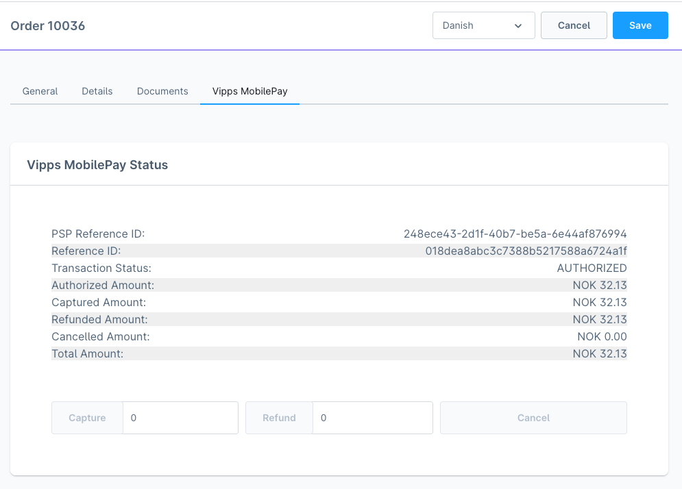

<!-- START_METADATA
---
title: Adjust payments
sidebar_label: Adjust payments
sidebar_position: 10
pagination_next: null
pagination_prev: null
---
END_METADATA -->

# Adjust payments

<!-- START_COMMENT -->
- [Order detail](#order-detail)
- [Vipps MobilePay Status](#vipps-mobilepay-status)
  - [Actions](#actions)
- [Delivery Status](#delivery-status)
<!-- END_COMMENT -->

## Order detail

When an order comes in from the creates it with [Vipps MobilePay's API](https://developer.vippsmobilepay.com/api/epayment/#tag/QueryPayments/operation/getPayment)
where we check the state of the payment

| State                     | Shopware Payment status | Shopware Delivery status | Shopware Order status | Supported |
|:--------------------------|------------------------:|-------------------------:|----------------------:|:---------:|
| [CREATED](#created)       |                    Open |                     Open |                  Open |     ✅    |
| [ABORTED](#aborted)       |               Cancelled |                     Open |                  Open |     ✅    |
| [EXPIRED](#expired)       |                    Open |                     Open |                  Open |     ❌    |
| [AUTHORIZED](#authorized) |              Authorized |                     Open |                  Open |     ✅    |
| [TERMINATED](#terminated) |                    Open |                     Open |                  Open |     ❌    |

### Created

### Aborted

### Expired

*Not supported*

### Authorized

### Terminated

*Not supported*

## Vipps MobilePay Status

Here, it's possible to see the status of an order; as well as the following:

- PSP Reference ID
- Reference ID
- Transaction Status
- Authorized Amount
- Captured Amount
- Refunded Amount
- Cancelled Amount
- Total Amount

### Actions

It's possible to perform actions  direct from Shopware administration on an order where there is paid with Vipps MobilePay

#### Capture

By default, if you click `Capture`, it will capture the full authorized amount and change the Payment Status to `Paid`.

#### Partial Capture

If you change the amount to capture and click `Capture`, it will capture the amount you have entered.
The max you can capture is the Authorized amount. It will change the Payment Status to `Partial paid`.

#### Refund

If you want to refund the full amount of the captured amount, then just click `Refund`. It will refund the full amount and change the Payment Status to `Refunded`.

#### Partial Refund

If you want to refund a part of the captured amount, then you just change the amount you want to and the click `Refund`. It will change the Payment Status to `Partial refunded`

#### Cancel

If you want to cancel an order, make sure there is nothing captured or refunded, and then you can just click `Cancel`. It will change the Payment status to `Cancelled`

## Delivery Status

We are listing to Delivery status

### Shipped

When an order's Delivery status changes to `Shipped`, the full amount will be captured.

### Returned

When an order's Delivery status changes to `Returned`, the full amount will be refunded

