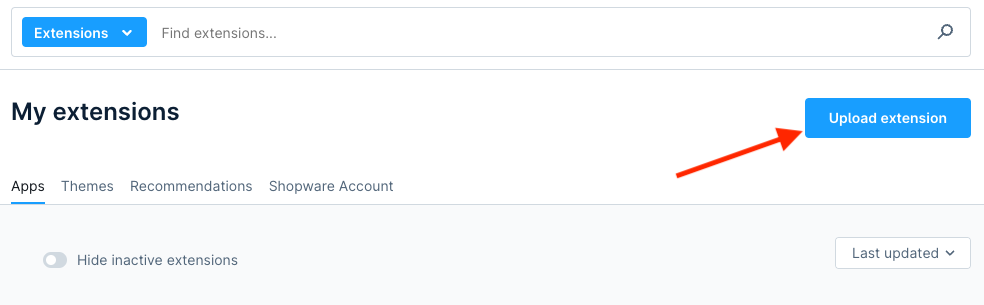
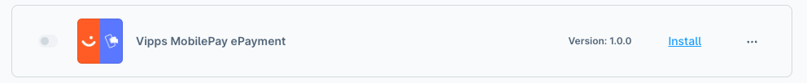
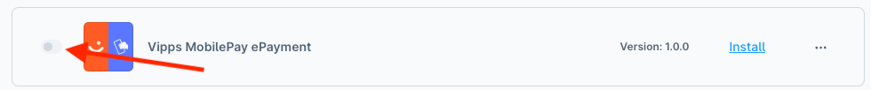
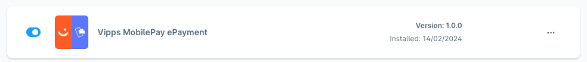
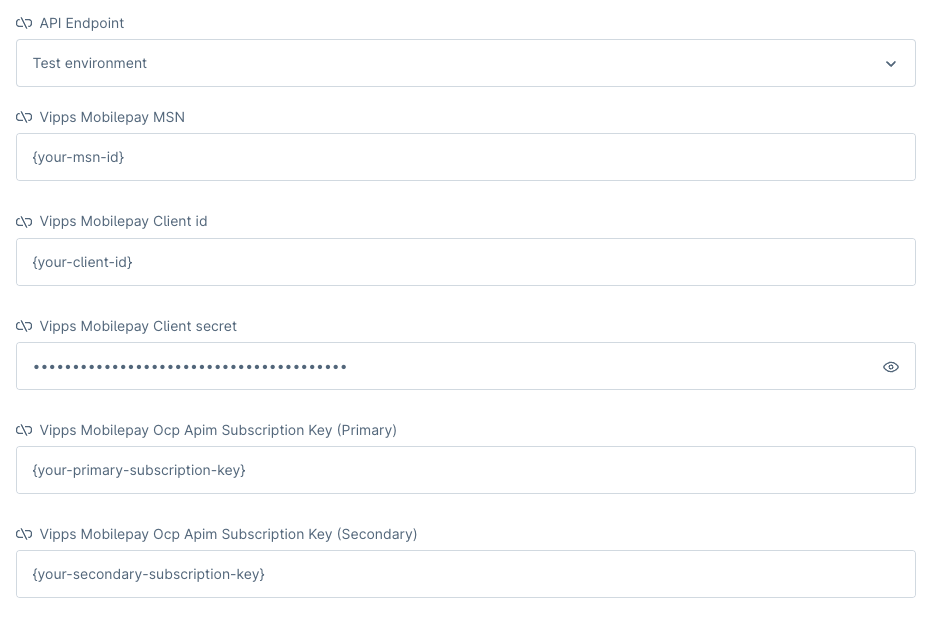
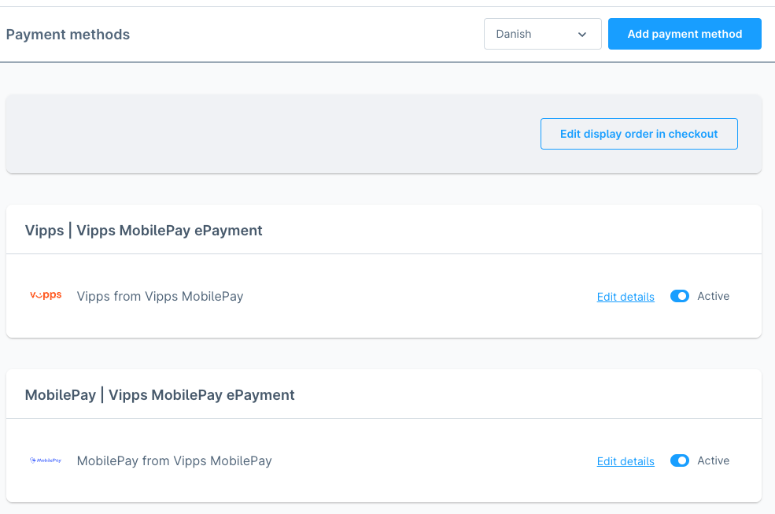
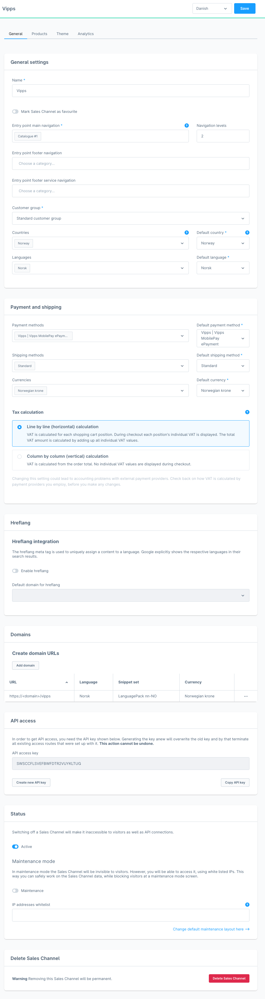

<!-- START_METADATA
---
title: Install and configure Shopware
sidebar_label: Install and configure
description: Install and configure Shopware
pagination_next: null
pagination_prev: null
---
END_METADATA -->

# Install and configure

<!-- START_COMMENT -->
- [Installation](#installation)
  - [Composer](#composer)
  - [Git](#git)
  - [Shopware UI](#shopware-ui)
- [Configure](#configure)
  - [Configuration of plugin](#configuration-of-plugin)
  - [Configuration of payment method](#configuration-of-payment-method)
  - [Configuration of SalesChannel](#configuration-of-saleschannel)
<!-- END_COMMENT -->

## Installation

### Composer

```bash
Coming soon
```

### GIT

Start by navigating into `/var/www/<project-name>/custom/plugins/` then clone the repository with `SSH` or `HTTPS`

```bash
git clone git@github.com:vippsas/shopware-plugin.git VippsMobilePayEPayment
```

### Composer & Git installment of plugin

Installing the plugin without using the shopware UI and activating the plugin

```bash
php bin/console plugin:install --activate VippsMobilepayEpayment
```

After running the installation and activation of the plugin clear the cache.

```bash
php bin/console cache:clear
```

The plugin is now installed and activated go to [configure](#configure)

### Shopware UI

Download the latest [release](https://github.com/vippsas/shopware-plugin/releases/latest)

Go to *My extensions* and click *Upload extension*.



Unzip the `*.zip` that you downloaded.

The plugin should now be available and should show up in the list.



Click *install* and wait for the page to refresh. When it's done click the active slider.



It should now be blue.



The plugin is installed and activated now go to the [configure](#configure) section.

## Configure

### Configuration of plugin

Start by clicking the 3 dots and the click *Configure*.


Select the sales channel that matches the [requirements](#requirements-for-saleschannel).

#### Parameters

- API Endpoint - Vipps MobilePay API URL, choose "Test environment" or "Production environment".
- Vipps MobilePay MSN - can be obtained through [portal.vippsmobilepay.com](https://portal.vippsmobilepay.com/).
- Vipps MobilePay Client ID - can be obtained through [portal.vippsmobilepay.com](https://portal.vippsmobilepay.com/).
- Vipps MobilePay Client secret - can be obtained through [portal.vippsmobilepay.com](https://portal.vippsmobilepay.com/).
- Vipps MobilePay Primary subscription key - can be obtained through [portal.vippsmobilepay.com](https://portal.vippsmobilepay.com/).
- Vipps MobilePay Secondary subscription key - can be obtained through [portal.vippsmobilepay.com](https://portal.vippsmobilepay.com/).



**REMEMBER** only use "production environment" for production keys, otherwise use "test environment".

To test if the right credentials are used, press the *Test API Connection*.
If there is no error, then the credentials are correct.
If there comes an error, then double-check the credentials to see if they're correct.

### Configuration of payment method

Start by going to `https://<domain>/admin#/sw/settings/payment/overview` to see that the payments are correctly installed.




### Configuration of SalesChannel

Go to the SalesChannel where you want to add Vipps or MobilePay.
It's **important** that the SalesChannel is configured the right way. For example:



#### Requirements for SalesChannel

| Merchant     | Countries    | Default Country | Languages | Default Languages | Currencies       | Default Currencies | Payment Methods                       |  Test environment  |  Production environment  |
|--------------|--------------|-----------------|-----------|-------------------|------------------|--------------------|---------------------------------------|:------------------:|:------------------------:|
| Vipps        | 🇳🇴 Norway    | Norway          | Norsk     | Norsk             | Norwegian krone  | Norwegian krone    | Vipps \| Vipps MobilePay \| ePayment  |         ✅          |            ✅             |
| MobilePay DA | 🇩🇰 Denmark   | Denmark         | Danish    | Danish            | Danish krone     | Danish krone       | MobilePay \| Vipps MobilePay \| ePayment |         ❌          |            ✅             |
| MobilePay FI | 🇫🇮 Finland   | Finland         | Suomi     | Suomi             | Finnish krone    | Finnish krone      | MobilePay \| Vipps MobilePay \| ePayment |         ❌          |            ✅             |
