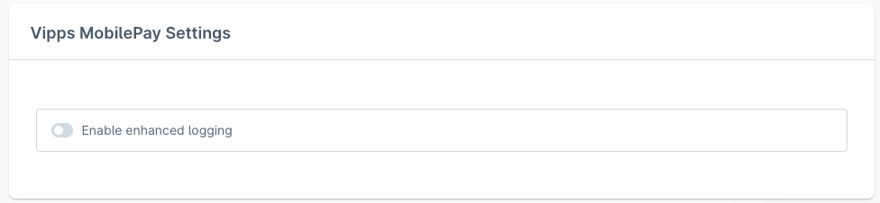
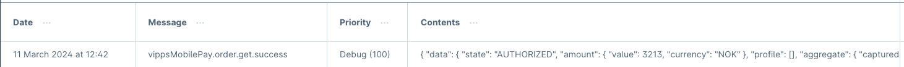

<!-- START_METADATA
---
title: Enhanced logging
sidebar_label: Enhanced logging
sidebar_position: 30
description: How to Enable enhanced logging for the Shopware Payments plugin
pagination_next: null
pagination_prev: null
---
END_METADATA -->

# Enhanced logging

<!-- START_COMMENT -->
- [Enable enhanced logging](#enable-enhanced-logging)
- [Logging level table](#logging-level-table)
<!-- END_COMMENT -->

## Enable enhanced logging

Go to *my extensions*, and then click the 3 dots for the plugin.


Click configure. Select the Sales Channel where you want enhanced logging.

Scroll down to *Vipps MobilePay Settings*, where you will see *Enable enhanced logging*.



Click *Enable enhanced logging* and clear the cache.

It's now possible to see all the logs `https://<domain>/admin#/sw/settings/logging/list` or *Settings* -> *System* -> *Event logs*.

For example, a log could look like this:



This is the content that gets set in the logging:

```php
'message' => $event,
'context' => $context,
'level' => $level,
'channel' => self::LOG_CHANNEL
```

## Logging level table

|    Level |                                                                     Message | Code |  Shows by default  |  Shows with enhanced logging  |
|---------:|----------------------------------------------------------------------------:|-----:|:------------------:|:-----------------------------:|
|    Debug |                                                  Detailed debug information |  100 |         ❌          |               ✅               |
|  Warning | Exceptional occurrences that are not errors.<br/> (e.g., use of deprecated APIs) |  300 |         ✅          |               ✅               |
|    Error |                                                              Runtime errors |  400 |         ✅          |               ✅               |
| Critical |                                                         Critical conditions |  500 |         ✅          |               ✅               |
